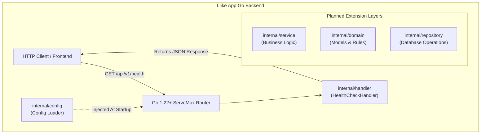
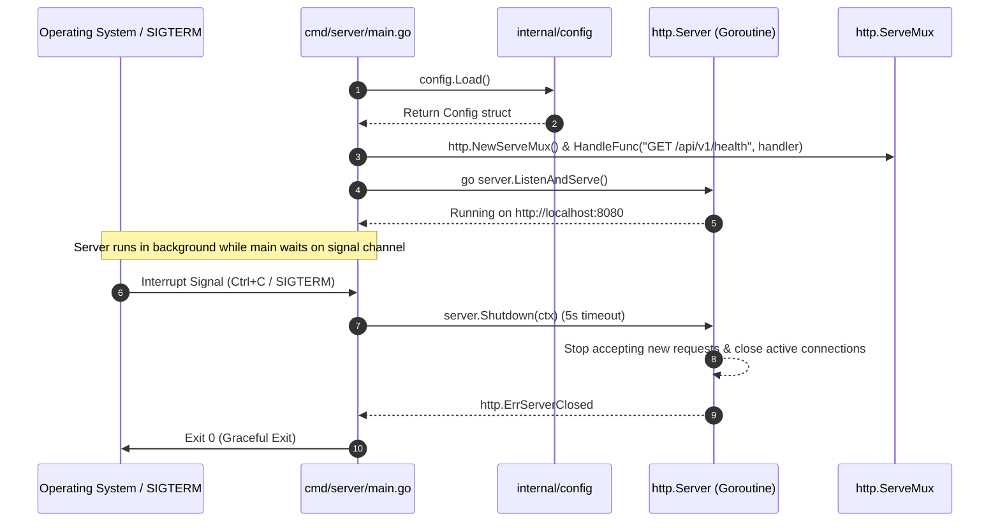

# PR Story: Phase 1 - Project Setup & Foundation

**PR Title:** `feat(backend): initialize layered Go project structure, configuration, and health check API`  
**Phase:** 1 (Project Setup & Go Backend Foundation)  
**Status:** Ready for Review / Approved  
**Date:** 2026-08-02  
**Target Branch:** `main`  

---

## 🎯 1. Summary & Objective

This PR establishes the foundational architecture for the **Liike App** Go backend. The primary goal of Phase 1 is to set up a clean, scalable layered project structure adhering to idiomatic Go project layout conventions (`cmd/`, `internal/`), environment configuration management with fallbacks, robust HTTP server configuration (using Go 1.22+ `http.NewServeMux`), a JSON health check endpoint, and graceful shutdown handling.

---

## 📂 2. Key Changes & File Structure

### Project Layout
```
liike_app/
├── .plans/
│   ├── action_plan.md
│   └── phase_1_project_setup.md
├── .pr_stories/
│   └── PR_STORY_PHASE_1.md
├── cmd/
│   └── server/
│       └── main.go           # Application entrypoint & HTTP server lifecycle
├── internal/
│   ├── config/
│   │   └── config.go         # Runtime configuration loader & environment parsing
│   ├── domain/               # Placeholder for future domain models & entities
│   ├── handler/
│   │   └── health.go         # HTTP handlers (GET /api/v1/health)
│   ├── repository/           # Placeholder for database persistence layer
│   └── service/              # Placeholder for core business logic layer
├── go.mod                    # Go module definition (liike_app)
└── go.sum                    # Dependency lockfile
```

### Summary of Modified/Created Files
- [go.mod](file:///home/vivaldev/code/liike_app/go.mod): Initialized module `liike_app` with Go 1.22+ toolchain, `modernc.org/sqlite` for database layer, and `golang.org/x/crypto/bcrypt`.
- [config.go](file:///home/vivaldev/code/liike_app/internal/config/config.go): Provides `config.Load()` to read environment variables (`PORT`, `DATABASE_URL`, `JWT_SECRET`, `APP_ENV`) with safe defaults.
- [health.go](file:///home/vivaldev/code/liike_app/internal/handler/health.go): Implements `HealthCheckHandler` returning `200 OK` with JSON timestamp, service name, status, and version.
- [main.go](file:///home/vivaldev/code/liike_app/cmd/server/main.go): Initializes configuration, registers Go 1.22 enhanced routing (`GET /api/v1/health`), configures timeouts (`ReadTimeout`, `WriteTimeout`, `IdleTimeout`), runs the server asynchronously, and traps OS signals (`SIGINT`, `SIGTERM`) for graceful shutdown with a 5-second context timeout.

---

## 📐 3. Architecture & System Diagrams

### 3.1 Layered Architecture Overview
The application follows standard Go layered architecture principles to ensure decoupling, testability, and future maintainability.



### 3.2 Application Startup & Graceful Shutdown Sequence
This diagram illustrates the non-blocking server execution and signal-trapping shutdown process.



---

## 🧪 4. Demonstration of Results & Verification

### 4.1 Application Startup Log Output
When running `go run ./cmd/server/main.go`:
```text
2026/08/02 15:00:30 [CONFIG] Asetukset ladattu. Ympäristö: development, Portti: 8080
2026/08/02 15:00:30 [SERVER] Liike App backend käynnissä osoitteessa http://localhost:8080
```

### 4.2 Health Check Endpoint (`GET /api/v1/health`)
Executed via `curl`:
```bash
curl -i http://localhost:8080/api/v1/health
```

**HTTP Output:**
```http
HTTP/1.1 200 OK
Content-Type: application/json
Date: Sun, 02 Aug 2026 12:00:38 GMT
Content-Length: 104

{
  "status": "OK",
  "timestamp": "2026-08-02T12:00:38.08738442Z",
  "service": "Liike App API",
  "version": "1.0.0"
}
```

### 4.3 Graceful Shutdown Log Output
Upon pressing `Ctrl+C` in the server terminal:
```text
2026/08/02 15:01:00 [SERVER] Sammutussignaali vastaanotettu. Suljetaan palvelin...
2026/08/02 15:01:00 [SERVER] Palvelin suljettu onnistuneesti.
```

---

## ✅ 5. Verification Matrix & Acceptance Criteria

| Criteria | Status | Details |
| :--- | :---: | :--- |
| `go.mod` and `go.sum` initialized | ✅ PASS | Created with Go 1.22+ and required core packages |
| Layered directory structure created | ✅ PASS | `cmd/`, `internal/{config,handler,service,domain,repository}` |
| Environment configuration with defaults | ✅ PASS | Loads `PORT`, `DATABASE_URL`, `JWT_SECRET`, `APP_ENV` |
| HTTP Server with Go 1.22 routing | ✅ PASS | Method-based route matching used (`GET /api/v1/health`) |
| JSON Health Check API | ✅ PASS | Returns HTTP 200 with dynamic UTC timestamp & metadata |
| Graceful Shutdown implementation | ✅ PASS | Traps `SIGINT`/`SIGTERM`, stops server within 5s context |

---

## 🚀 6. Next Steps & Roadmap

- **Phase 2 (Database Integration & Models):** Configure SQLite connection pool using `modernc.org/sqlite`, run initial migrations, and create `internal/repository` implementation.
- **Phase 3 (Authentication & User Domain):** Implement user registration, login, password hashing (`bcrypt`), and JWT token issuance.
