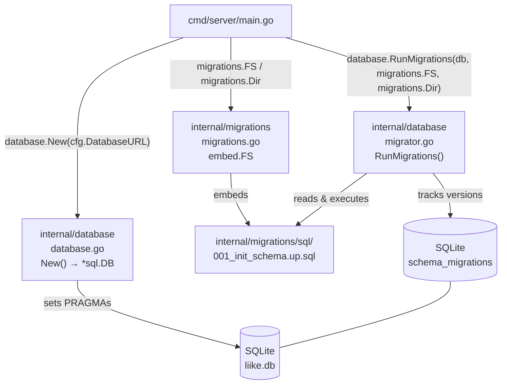
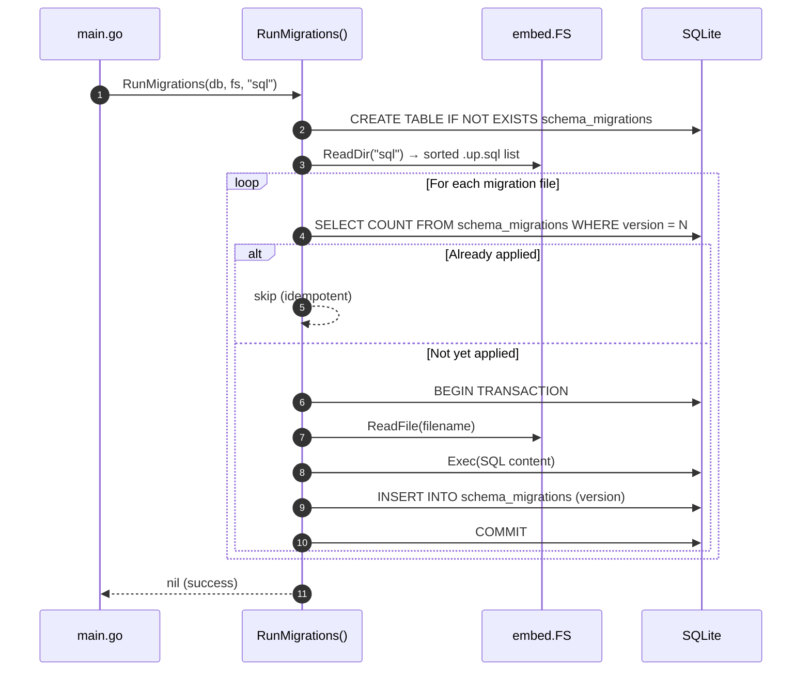
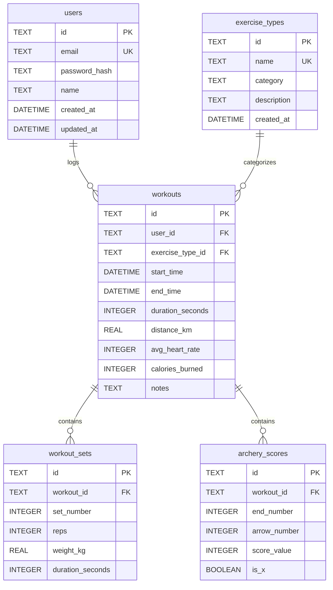

# PR Story: Phase 2 - SQLite Database Setup & Domain Models

**PR Title:** `feat(db): add SQLite connection, WAL pragmas, embed.FS migrations, and domain models`
**Branch:** `feat/phase-2-database-setup`
**Phase:** 2 (Database Setup & Domain Models)
**Status:** Ready for Review
**Date:** 2026-08-03
**Target Branch:** `main`

---

## 🎯 1. Summary & Objective

Phase 2 establishes the full database foundation for the Liike App Go backend. This PR delivers:

- **SQLite connection** via `modernc.org/sqlite` with production-grade PRAGMA configuration (WAL mode, foreign keys, busy timeout)
- **Idempotent schema migrations** tracked via a `schema_migrations` table using `embed.FS` — migrations run safely on every startup
- **Complete domain model** for all five core entities: `User`, `ExerciseType`, `Workout`, `WorkoutSet`, `ArcheryScore`
- **`internal/migrations` package** to cleanly embed SQL files (works around Go's `//go:embed` path restriction)
- **Unit test suite** covering database connection, migration idempotency, pragma verification, and all domain struct invariants

---

## 📂 2. Key Changes & File Structure

```
liike_app/
├── cmd/server/
│   └── main.go                          # Updated: uses migrations.FS instead of local embed
├── internal/
│   ├── database/
│   │   ├── database.go                  # NEW: New() – SQLite open + 4 PRAGMAs + Ping
│   │   ├── database_test.go             # NEW: 4 tests – connection, foreign_keys, WAL, invalid path
│   │   ├── migrator.go                  # NEW: RunMigrations() – idempotent embed.FS runner
│   │   ├── migrator_test.go             # NEW: 5 tests – schema table, apply all, idempotent, users table, re-run
│   │   └── testdata/migrations/
│   │       ├── 001_create_users.up.sql
│   │       └── 002_create_exercise_types.up.sql
│   ├── domain/
│   │   ├── user.go                      # NEW: User struct (password_hash hidden from JSON)
│   │   ├── exercise_type.go             # NEW: ExerciseType + ExerciseCategory constants
│   │   ├── workout.go                   # NEW: Workout + WorkoutSet structs (nullable fields)
│   │   ├── archery.go                   # NEW: ArcheryScore struct
│   │   └── domain_test.go              # NEW: 9 tests – JSON marshaling, nil defaults, constants
│   └── migrations/
│       ├── migrations.go                # NEW: embed.FS package (FS + Dir constants)
│       └── sql/
│           ├── 001_init_schema.up.sql   # Full schema: users, exercise_types, workouts, sets, archery
│           └── 001_init_schema.down.sql # Teardown in dependency order
└── migrations/                          # Reference SQL (not embedded – for tooling/DBA use)
    ├── 001_init_schema.up.sql
    └── 001_init_schema.down.sql
```

### Summary of Modified/Created Files
- [database.go](file:///home/vivaldev/code/liike_app/internal/database/database.go): Opens SQLite with `PRAGMA foreign_keys`, `journal_mode=WAL`, `busy_timeout=5000`, `synchronous=NORMAL` and verifies connection with `Ping()`.
- [migrator.go](file:///home/vivaldev/code/liike_app/internal/database/migrator.go): Reads `.up.sql` files from `embed.FS`, sorts them numerically, and applies only unapplied versions — tracking state in `schema_migrations`.
- [migrations.go](file:///home/vivaldev/code/liike_app/internal/migrations/migrations.go): Dedicated package that embeds `sql/*.sql` — Go's `//go:embed` requires files to be in the same or a child directory, making this the correct architectural pattern.
- [main.go](file:///home/vivaldev/code/liike_app/cmd/server/main.go): Replaced local `//go:embed migrations/*.sql` (which broke at test time) with `migrations.FS` and `migrations.Dir` from the new package.
- Domain files: All structs use `string` for UUIDs (stored as TEXT in SQLite), `*T` for nullable fields, and `time.Time` for timestamps with `json:"..."` tags following REST conventions.

---

## 📐 3. Architecture & System Diagrams

### 3.1 Database Layer Architecture



### 3.2 Migration Execution Flow



### 3.3 Domain Model Entity Relationships



---

## 🧪 4. Demonstration of Results & Verification

### 4.1 Server Startup Log (`task dev`)
```text
2026/08/03 11:53:53 [CONFIG] Asetukset ladattu. Ympäristö: development, Portti: 8080
2026/08/03 11:53:53 [DB] Tietokantayhteys luotu onnistuneesti: liike.db
2026/08/03 11:53:53 [DB] Tietokantamigraatiot ajettu onnistuneesti.
2026/08/03 11:53:53 [SERVER] Liike App backend käynnissä osoitteessa http://localhost:8080
```

### 4.2 Full Test Suite (`task test`)
```text
ok  liike_app/internal/config    coverage: 100.0%
ok  liike_app/internal/database  coverage: 72.0%   (9 tests PASS)
ok  liike_app/internal/domain    (9 tests PASS)
ok  liike_app/internal/handler   coverage: 80.0%
```

### 4.3 Unit Tests — database package
| Test | Result |
|:---|:---:|
| `TestNew_InMemory` | ✅ PASS |
| `TestNew_PragmaForeignKeys` | ✅ PASS |
| `TestNew_PragmaJournalMode` | ✅ PASS |
| `TestNew_InvalidPath` | ✅ PASS |
| `TestRunMigrations_CreatesSchemaTable` | ✅ PASS |
| `TestRunMigrations_AppliesAllMigrations` | ✅ PASS |
| `TestRunMigrations_Idempotent` | ✅ PASS |
| `TestRunMigrations_CreatesUserTable` | ✅ PASS |
| `TestRunMigrations_NoUpSqlFiles` | ✅ PASS |

### 4.4 Unit Tests — domain package
| Test | Result |
|:---|:---:|
| `TestUser_JSONMarshal_OmitsPasswordHash` | ✅ PASS |
| `TestUser_ZeroValue` | ✅ PASS |
| `TestExerciseCategory_Constants` | ✅ PASS |
| `TestExerciseType_JSONMarshal` | ✅ PASS |
| `TestWorkout_OptionalFieldsNil` | ✅ PASS |
| `TestWorkout_JSONMarshal_OmitsEmptyRelations` | ✅ PASS |
| `TestWorkoutSet_Fields` | ✅ PASS |
| `TestArcheryScore_IsXDefault` | ✅ PASS |
| `TestArcheryScore_JSONMarshal` | ✅ PASS |

### 4.5 Static Analysis (`task check`)
```text
go vet ./...        → no issues
go test -cover ./... → all PASS
[TASK] All checks passed cleanly!
```

---

## ✅ 5. Verification Matrix & Acceptance Criteria

| Criteria | Status | Details |
| :--- | :---: | :--- |
| SQLite PRAGMAs: `foreign_keys`, `WAL`, `busy_timeout`, `synchronous` | ✅ PASS | Verified via `PRAGMA` queries in unit tests |
| `schema_migrations` table created automatically | ✅ PASS | `TestRunMigrations_CreatesSchemaTable` |
| Migrations idempotent (safe to re-run) | ✅ PASS | `TestRunMigrations_Idempotent` (3× re-run) |
| `001_init_schema.up.sql` creates all 5 tables + seed data | ✅ PASS | Runtime log + `TestRunMigrations_CreatesUserTable` |
| Domain entities use `string` UUIDs & `*T` nullable fields | ✅ PASS | All domain structs verified |
| `password_hash` hidden from JSON (`json:"-"`) | ✅ PASS | `TestUser_JSONMarshal_OmitsPasswordHash` |
| `embed.FS` path issue fixed (`internal/migrations` package) | ✅ PASS | `task test` passes without embed errors |
| `task check` and `task test` pass without errors | ✅ PASS | All checks clean |
| Server starts and runs migrations on boot | ✅ PASS | `task dev` log output verified |

---

## 🚀 6. Next Steps & Roadmap

- **Phase 3 (Authentication):** Implement `POST /api/v1/auth/register` and `POST /api/v1/auth/login` using `bcrypt` password hashing and JWT token issuance. Wire `internal/repository` user queries.
- **Phase 4 (Workout API):** Build CRUD endpoints for workouts, sets, and archery scores with JWT middleware authorization.
