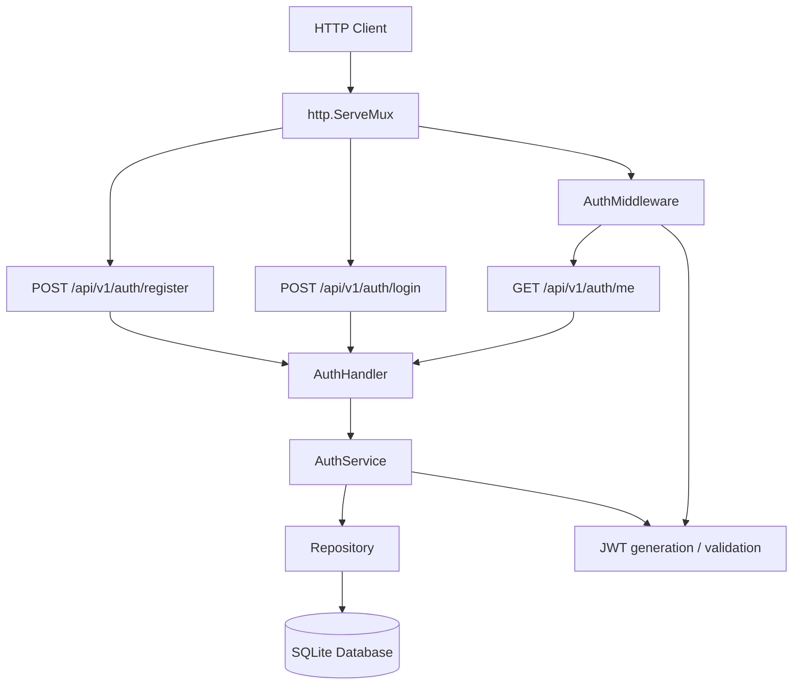
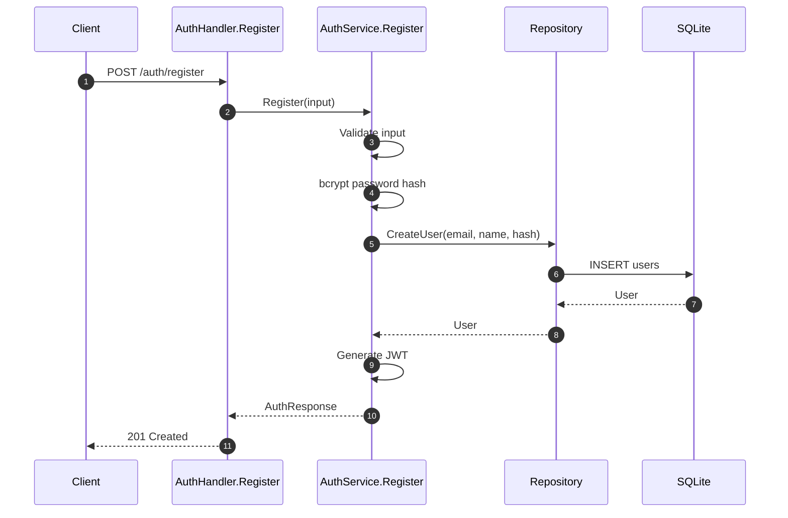
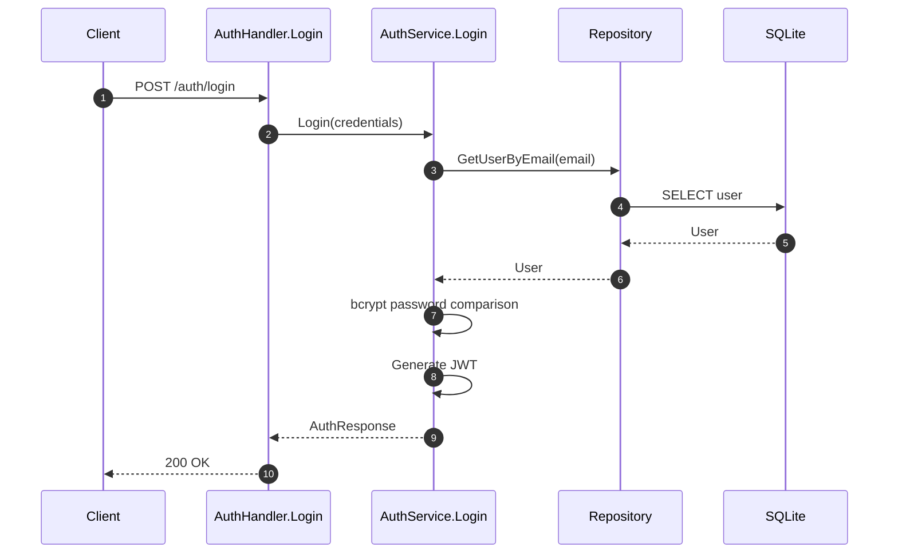
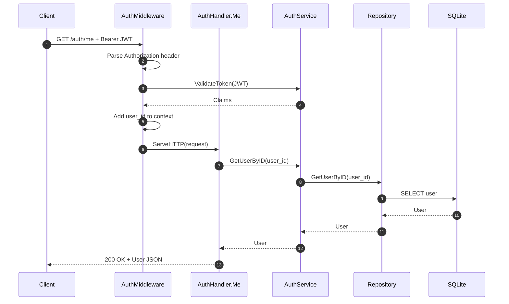

# PR Story: Phase 3 - Authentication, JWT Security & HTTP Auth Flow

**PR Title:** `feat(backend): authentication and logic with jwt tokens`  
**Branch:** `feat/auth-jwt`  
**Phase:** 3 (Authentication & Authorization)  
**Status:** Ready for Review  
**Date:** 2026-08-04  
**Target Branch:** `main`

---

## 🎯 1. Summary & Objective

Phase 3 introduces the authentication foundation for the Liike App Go backend.

This PR establishes the complete authentication flow from HTTP handlers through the service and repository layers to SQLite, and adds JWT-based request authentication for protected endpoints.

The implementation delivers:

- **Repository layer** for user persistence and lookup
- **Authentication service** for registration and login
- **bcrypt password hashing** before credentials are persisted
- **JWT token generation and validation**
- **Authentication middleware** for protected HTTP routes
- **Authentication handlers** for registration, login, and current-user lookup
- **Dependency injection wiring** in `cmd/server/main.go`
- **Comprehensive unit tests** for repository, service, middleware, and handler behavior
- Domain timestamp correction from `string` to `time.Time`
- Authentication flow-control fixes and database schema corrections
- Project-level Git ignore updates for internal planning notes and local SQLite databases

The resulting architecture separates HTTP concerns, authentication/business logic, persistence, and authorization concerns cleanly while keeping dependencies explicit.

---

## 📂 2. Key Changes & File Structure

```text
liike_app/
├── cmd/server/
│   └── main.go
│       # Updated: dependency injection and HTTP route wiring
│
├── internal/
│   ├── domain/
│   │   ├── user.go
│   │   │   # User timestamps use time.Time
│   │   └── domain_test.go
│   │       # Updated domain JSON tests
│   │
│   ├── repository/
│   │   ├── user_repository.go
│   │   │   # CreateUser, GetUserByEmail, GetUserByID, scanUser
│   │   └── user_repository_test.go
│   │       # Repository unit tests
│   │
│   ├── services/
│   │   ├── auth_service.go
│   │   │   # Register, Login, JWT generation/validation
│   │   └── auth_service_test.go
│   │       # Authentication service tests
│   │
│   ├── middleware/
│   │   ├── auth.go
│   │   │   # JWT Authorization middleware
│   │   └── auth_test.go
│   │       # Middleware and context tests
│   │
│   └── handler/
│       ├── auth_handler.go
│       │   # Register, Login and Me HTTP handlers
│       └── auth_handler_test.go
│           # Handler tests including /me
│
├── go.mod
├── go.sum
└── .gitignore
```

### Summary of Modified/Created Files

### `internal/repository/user_repository.go`

Introduces the persistence API required by authentication:

- `CreateUser`
- `GetUserByEmail`
- `GetUserByID`
- internal `scanUser` helper

The repository owns SQL interaction and translates database-level conditions such as duplicate email and missing users into application-level errors.

### `internal/services/auth_service.go`

Introduces the authentication service boundary.

`Register`:

1. validates registration input
2. hashes the password using bcrypt
3. persists the user through the repository
4. generates a JWT
5. returns the token and created user

`Login`:

1. looks up the user by email
2. verifies the bcrypt password hash
3. generates a JWT
4. returns the authenticated user and token

The service also exposes `GetUserByID` for the authenticated `/me` flow.

### `internal/middleware/auth.go`

Introduces the HTTP authentication boundary.

The middleware:

1. reads the `Authorization` header
2. validates the `Bearer <token>` format
3. validates the JWT
4. extracts the authenticated user's ID and email
5. places those values into the request context
6. forwards the request to the next handler

Invalid or missing authentication terminates the request with HTTP `401 Unauthorized`.

### `internal/handler/auth_handler.go`

Adds three authentication endpoints:

```text
POST /api/v1/auth/register
POST /api/v1/auth/login
GET  /api/v1/auth/me
```

The `/me` endpoint expects the authentication middleware to have populated the request context with the authenticated user's ID.

### `cmd/server/main.go`

Connects the application layers through explicit dependency injection:

```text
Database
   ↓
Repository
   ↓
AuthService
   ↓
AuthHandler

AuthService
   ↓
AuthMiddleware
```

The protected `/api/v1/auth/me` route is registered through the authentication middleware.

---

## 📐 3. Architecture & System Diagrams

### 3.1 Authentication Architecture



### 3.2 Registration Flow



### 3.3 Login Flow



### 3.4 Protected `/me` Flow



---

## 🧪 4. Testing & Verification

The authentication implementation is covered at multiple layers rather than relying exclusively on endpoint-level tests.

### 4.1 Repository Tests

Repository tests cover the user persistence boundary, including:

- user creation
- user lookup by email
- user lookup by ID
- duplicate email handling
- missing-user behavior
- database scanning

The repository layer has previously been measured at approximately **90.9% coverage**.

### 4.2 Authentication Service Tests

The service test suite covers:

- registration validation
- successful registration
- bcrypt password hashing
- duplicate email behavior
- successful login
- invalid credentials
- JWT generation
- JWT claim contents
- token expiration/issued-at behavior
- token validation

The authentication service has previously been measured at approximately **86.7% coverage**.

### 4.3 Middleware Tests

Middleware tests cover:

- valid JWT authentication
- missing Authorization header
- invalid Authorization format
- missing Bearer token
- invalid JWT
- user ID propagation into request context
- user email propagation into request context
- context helper behavior
- missing/invalid context values

The middleware was measured at **100% coverage** before the latest test additions.

### 4.4 Handler Tests

The handler suite covers:

#### Register

- successful registration
- invalid JSON
- missing email
- missing name
- too-short password
- duplicate email

#### Login

- successful login
- wrong password
- unknown user
- invalid JSON

#### Me

- authenticated user successfully returned
- missing user ID in context → `401 Unauthorized`
- user ID present but user missing → `404 Not Found`

The `/me` success test also verifies that sensitive password-hash information is not exposed through the JSON response.

The latest handler coverage should be measured again with:

```bash
task test:coverage
```

because the `/me` test suite was added after the original coverage figure was recorded.

---

## 🔐 5. Security Considerations

Authentication is implemented with several important security properties:

- Passwords are never stored in plaintext.
- Passwords are hashed using bcrypt.
- JWT tokens are signed using HMAC.
- JWTs contain an explicit expiration time.
- Protected routes require a valid Bearer token.
- Authentication failures return `401 Unauthorized`.
- Password hashes are excluded from JSON serialization using `json:"-"`.
- User identity is propagated through request context rather than through request parameters.

One remaining hardening opportunity is to explicitly pin JWT validation to the same HS256 algorithm used during token creation rather than accepting the broader HMAC method family.

---

## 📊 6. Verification Matrix & Acceptance Criteria

| Criteria | Status | Details |
| :--- | :---: | :--- |
| Repository user creation implemented | ✅ PASS | `CreateUser` implemented and tested |
| User lookup by email implemented | ✅ PASS | `GetUserByEmail` implemented and tested |
| User lookup by ID implemented | ✅ PASS | `GetUserByID` implemented |
| Registration input validation | ✅ PASS | Required fields and password length validated |
| Password hashing | ✅ PASS | bcrypt used before persistence |
| Login credential verification | ✅ PASS | bcrypt comparison with invalid-credential handling |
| JWT generation | ✅ PASS | HS256 token with user claims |
| JWT expiration | ✅ PASS | 24-hour expiry configured |
| JWT middleware | ✅ PASS | Bearer token extraction and validation |
| User ID propagated to request context | ✅ PASS | Middleware/context tests |
| `POST /api/v1/auth/register` | ✅ PASS | Handler implemented and tested |
| `POST /api/v1/auth/login` | ✅ PASS | Handler implemented and tested |
| `GET /api/v1/auth/me` | ✅ PASS | Protected handler implemented and tested |
| `/me` without authentication | ✅ PASS | Returns `401 Unauthorized` |
| `/me` with missing user | ✅ PASS | Returns `404 Not Found` |
| Password hash hidden from JSON | ✅ PASS | Domain JSON behavior tested |
| Dependency injection wired in `main.go` | ✅ PASS | Repository → service → handler/middleware |
| Graceful HTTP shutdown preserved | ✅ PASS | `server.Shutdown` with timeout |
| Domain timestamps use `time.Time` | ✅ PASS | Domain model updated |
| SQLite schema/index syntax corrected | ✅ PASS | Migration-related correction included |
| Static analysis | 🟡 VERIFY | Run `task check` on final head |
| Full test suite | 🟡 VERIFY | Run `task test` on final head |
| Final coverage | 🟡 VERIFY | Run `task test:coverage` after latest test additions |

---

## 🚀 7. Next Steps & Roadmap

With the authentication foundation in place, the next phase can build authenticated application functionality on top of the established identity boundary.

### Immediate follow-up

- Run the complete verification suite:

```bash
task check
task test
task test:coverage
```

- Add a focused `AuthService.GetUserByID` unit test.
- Pin JWT validation explicitly to HS256.

### Phase 4 — Workout API

Build authenticated CRUD endpoints for:

- workouts
- workout sets
- archery scores

All user-owned resources should use the authenticated `user_id` from the request context rather than accepting arbitrary ownership information from the client.

This provides the foundation for enforcing:

```text
Authenticated User
       ↓
JWT Middleware
       ↓
user_id in Context
       ↓
Handler
       ↓
Service
       ↓
Repository
       ↓
User-scoped data
```

The authentication layer introduced in Phase 3 therefore becomes the authorization boundary for the upcoming workout functionality.
