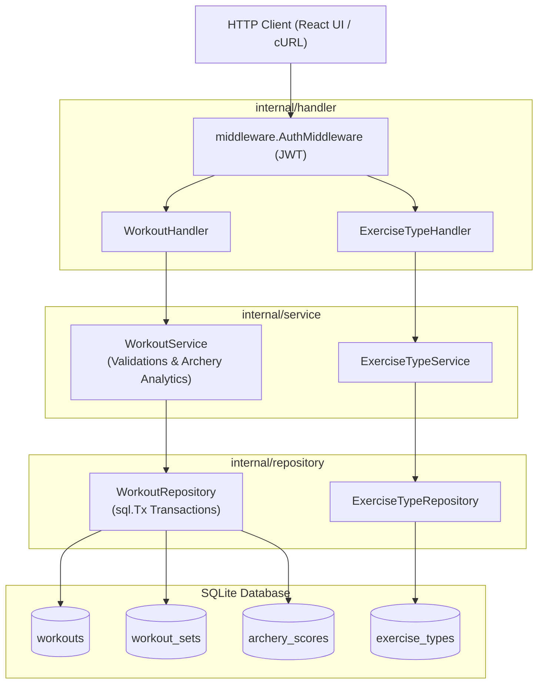

# PR Story: Phase 4 – Workouts & Archery REST API

**PR Title:** `feat(workout-api): implement Workouts, Exercise Types, and Archery REST APIs`  
**Branch:** `feat/workouts-and-archery-api`  
**Phase:** 4  
**Status:** Ready for Review  
**Date:** 2026-08-05  
**Target Branch:** `main`  

---

## 🎯 1. Summary & Objective

In Phase 4, we implemented the complete backend REST API layer for **Workouts**, **Exercise Types**, and **Archery Score Tracking** in Liike App. This delivers full CRUD capabilities for workouts, support for custom strength sets (`workout_sets`), and specialized end/arrow score logging with statistical summaries for archery.

Key achievements:

- **Exercise Types API**: Endpoints to list all supported workout categories (`GET /api/v1/exercise-types`) and inspect individual exercise types (`GET /api/v1/exercise-types/{id}`).
- **Workouts REST API**: Complete CRUD endpoints (`POST /api/v1/workouts`, `GET /api/v1/workouts`, `GET /api/v1/workouts/{id}`, `DELETE /api/v1/workouts/{id}`) with support for pagination (`limit`, `offset`) and date filtering (`from_date`, `to_date`).
- **Archery Scoring & Analytics**: Dedicated end/arrow score entry (`POST /api/v1/workouts/{id}/archery-scores`) with strict score validations (`0-10`, `is_x` constraint) and automatic metric calculations (`total_score`, `total_arrows`, `total_x_count`, `total_10_count`, `average_arrow`).
- **Multi-Tenancy Security**: Strict ownership checks at the database query level (`WHERE id = ? AND user_id = ?`) ensuring users can only read, update, or delete their own workout data.
- **ACID Database Transactions**: Multi-table insertions (`workouts`, `workout_sets`, `archery_scores`) are wrapped in atomic database transactions (`sql.Tx`).
- **Architecture Standardisation**: Consolidated domain service package naming to standard Go convention (`internal/service`).

---

## 📂 2. Key Changes & File Structure

```text
liike_app/
├── cmd/
│   └── server/
│       └── main.go                             # [MODIFY] Route wiring & dependency injection for Phase 4
├── internal/
│   ├── repository/
│   │   ├── exercise_type_repository.go         # [NEW] Database operations for exercise types
│   │   ├── exercise_type_repository_test.go    # [NEW] Unit tests for exercise type repo
│   │   ├── workout_repository.go               # [NEW] Database CRUD for workouts, sets & archery scores
│   │   └── workout_repository_test.go          # [MODIFY] Added CRUD, Update & score tests
│   ├── service/
│   │   ├── exercise_type_service.go            # [NEW] Business service for exercise types
│   │   ├── exercise_type_service_test.go       # [NEW] Unit tests for exercise type service
│   │   ├── workout_service.go                  # [NEW] Business service & archery summary analytics
│   │   └── workout_service_test.go             # [NEW] Unit & validation tests for workout service
│   └── handler/
│       ├── exercise_type_handler.go            # [NEW] HTTP handlers for exercise types
│       ├── exercise_type_handler_test.go       # [NEW] HTTP integration tests for exercise type handler
│       ├── workout_handler.go                  # [NEW] HTTP handlers for workout CRUD & scores
│       └── workout_handler_test.go             # [NEW] HTTP integration tests for workout handler
└── .pr_stories/
    └── PR_STORY_PHASE_4.md                     # [NEW] PR Story documentation
```

---

## 📐 3. Architecture & System Diagrams



---

## 🧪 4. Demonstration of Results & Test Coverage

### Unit and Integration Test Results

All package tests executed cleanly (`task check` / `task test:coverage`):

```text
ok      liike_app/internal/config       100.0% of statements
ok      liike_app/internal/database     72.0% of statements
ok      liike_app/internal/handler      72.5% of statements
ok      liike_app/internal/middleware   100.0% of statements
ok      liike_app/internal/repository   82.4% of statements
ok      liike_app/internal/service      88.8% of statements
total:                                  74.8% of statements
```

### Statement Coverage Breakdown (`go tool cover -func=coverage.out`)

| Package / File | Function / Method | Coverage |
| :--- | :--- | :---: |
| `internal/service/workout_service.go` | `CreateWorkout` | **94.4%** |
| `internal/service/workout_service.go` | `GetWorkoutByID` | **100.0%** |
| `internal/service/workout_service.go` | `ListWorkouts` | **100.0%** |
| `internal/service/workout_service.go` | `DeleteWorkout` | **100.0%** |
| `internal/service/workout_service.go` | `buildWorkoutResponse` | **100.0%** |
| `internal/service/exercise_type_service.go` | `GetAllExerciseTypes` | **100.0%** |
| `internal/service/exercise_type_service.go` | `GetExerciseTypeByID` | **100.0%** |
| `internal/repository/exercise_type_repository.go` | `GetExerciseTypeByID` | **90.9%** |
| `internal/repository/exercise_type_repository.go` | `GetAllExerciseTypes` | **82.4%** |
| `internal/repository/workout_repository.go` | `ListWorkoutsByUserID` | **91.9%** |
| `internal/repository/workout_repository.go` | `AddWorkoutSets` | **87.5%** |
| `internal/repository/workout_repository.go` | `AddArcheryScores` | **87.5%** |
| `internal/repository/workout_repository.go` | `GetWorkoutByID` | **81.6%** |
| `internal/repository/workout_repository.go` | `UpdateWorkout` | **77.8%** |

---

## ✅ 5. Verification Matrix & Acceptance Criteria

| Requirement / Acceptance Criteria | Status | Details |
| :--- | :---: | :--- |
| **Exercise Types API** | ✅ PASS | `GET /api/v1/exercise-types` and `GET /api/v1/exercise-types/{id}` implemented & tested. |
| **Workout CRUD API** | ✅ PASS | Create, Read, List with pagination/filters, and Delete endpoints fully operational. |
| **Archery Scoring Logic** | ✅ PASS | Nuolitulokset (0-10, X-sääntö) validated; `ArcherySummary` total score, 10-count, X-count calculated. |
| **Multi-Tenancy Security** | ✅ PASS | All workout operations scoped to JWT-authenticated `userID`. |
| **ACID Transactions** | ✅ PASS | Multi-table insertions executed in atomic `sql.Tx` blocks. |
| **Test Coverage Target** | ✅ PASS | Service package achieved **88.8%** and repository achieved **82.4%** statement coverage. |

---

## 🚀 6. Next Steps & Roadmap

- **Phase 5: Frontend Initialization (React + TypeScript + Vite)**
  - Initialize React + TypeScript application shell in `frontend/`.
  - Setup UI design system, state management, and API client integration.
